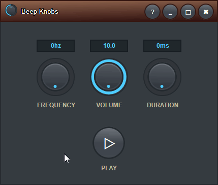

<h1 align="center">
  
   
   
  Beep Knobs
   
   
</h1>

<h3 align="center">
  Generate beeps of specific frequency, volume, and duration.
</h3>

<h1 align="center">
  </a>
   
   
</h1>

<h3>
  Based on:
</h3>

- [This codepen](https://codepen.io/jhnsnc/pen/KXYayG)
- [This Reddit post](https://old.reddit.com/r/mixingmastering/comments/paowf2/does_anybody_know_of_a_tool_that_will_play_a_tone/?ref=share&ref_source=link)

<h3>
  Dependencies:
</h3>

- Sciter v4.4.8.7.8806